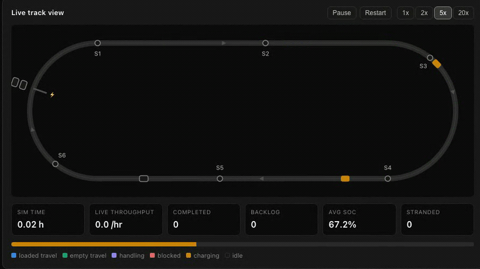
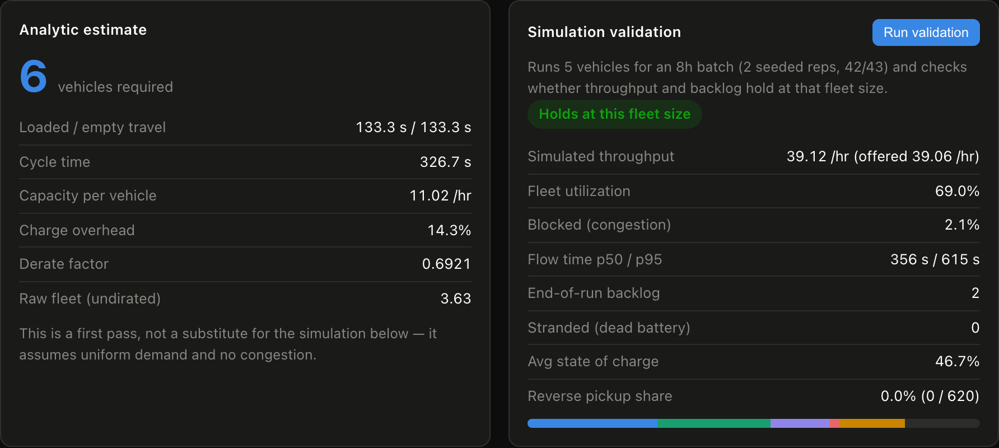
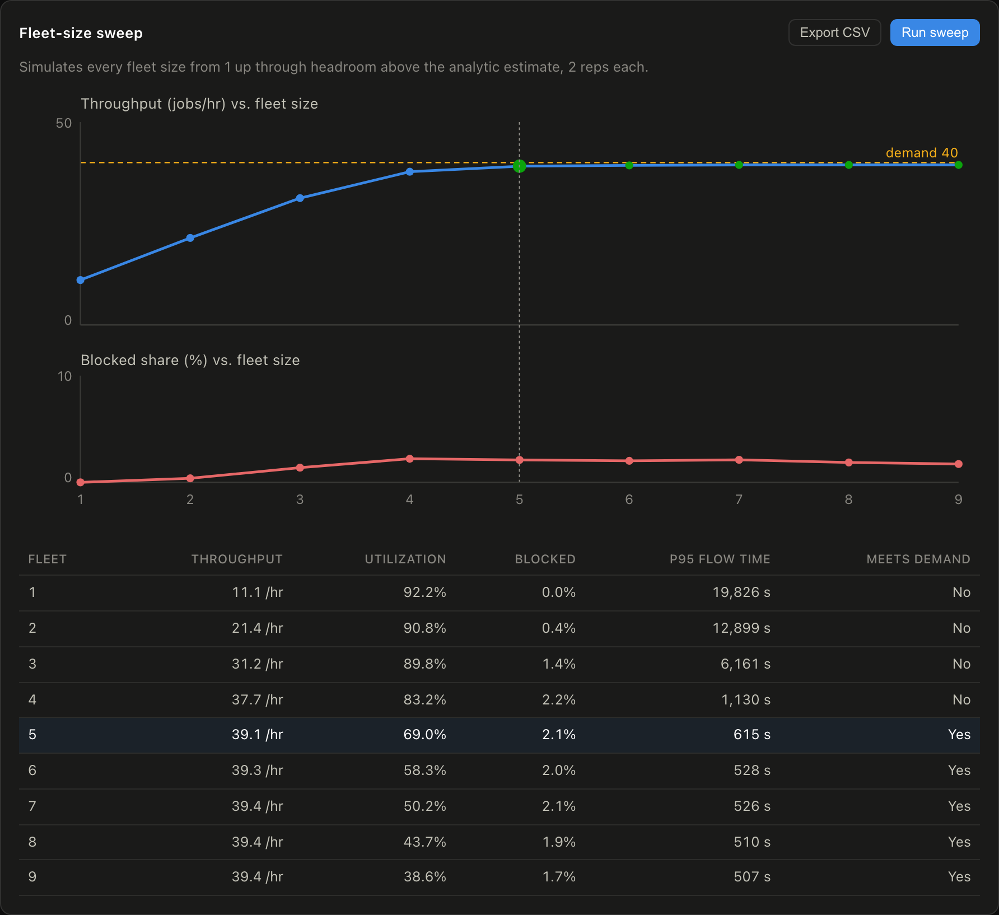
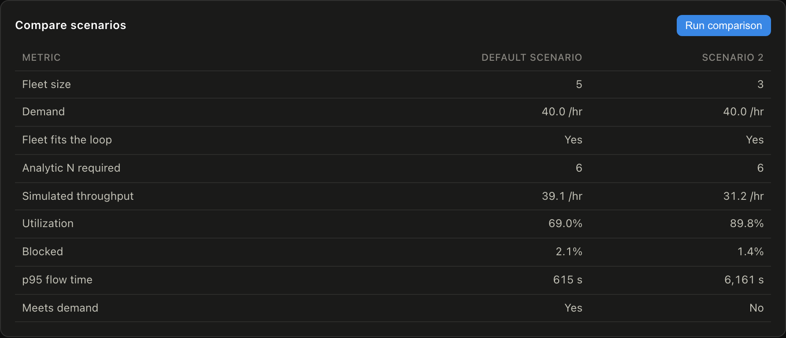
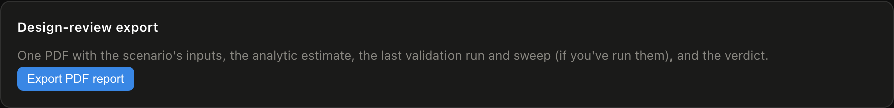
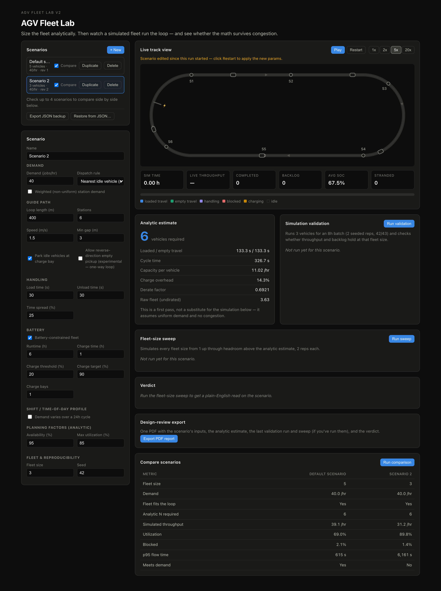

# AGV Fleet Lab

[](https://github.com/JesseDiaz47/AGV-Fleet-Lab/actions/workflows/ci.yml)
[](./LICENSE)
[](https://www.typescriptlang.org/)
[](https://react.dev/)
[](https://github.com/JesseDiaz47/AGV-Fleet-Lab/commits/main)

AGV fleet-sizing tool: sizes a one-way-loop AGV fleet analytically, then
**validates the answer with a discrete-event simulation** — congestion,
blocking, station queues, battery/charging, structured demand, dispatch
rules, and shift profiles.



Built by Jesse Diaz. Educational/planning-grade tool — not a substitute for a
full DES study (Plant Simulation / FlexSim / AnyLogic) or vendor sign-off. All
default numbers are fictional examples.

This is the **v2 rebuild**: Vite + React + TypeScript, named scenarios,
scenario comparison, and CSV/PDF export. It grew out of an earlier
single-file, zero-setup version of the same tool, which is kept privately as
an offline handout artifact.

## What it does

Everything below is the app running on its default scenario — 40 jobs/hr around
a 400 m loop with 6 stations. The numbers are fictional, the behavior is not.

### 1. Size the fleet, then check the math against a simulation

The analytic pass is a napkin estimate: cycle time, capacity per vehicle, a
derate for availability and charging. It says **6 vehicles**. The seeded
simulation then runs that scenario for an 8-hour batch and reports what
actually happened — here 5 vehicles already hold demand at 69% utilization, so
the analytic derate was conservative.



### 2. Sweep every fleet size to find the knee

Each fleet size is simulated and plotted against demand. The knee is the
smallest fleet that meets demand; past it, throughput flattens while extra
vehicles just add congestion.



### 3. Compare scenarios side by side

Named scenarios are versioned records, so a comparison is a real diff rather
than a re-typed guess. Dropping from 5 vehicles to 3 costs 8 jobs/hr — and
takes p95 flow time from 615 s to 6,161 s.



### 4. Export for design review

CSV for the sweep table, and a PDF report carrying the scenario inputs, both
model results, and the plain-English verdict — so a reviewer never has to open
the app.



▶ **[Full walkthrough (27s, silent MP4)](docs/media/tour.mp4)** — the whole
flow above, end to end.

<details>
<summary>The full interface in one shot</summary>



</details>

## Development

```bash
npm install
npm run dev         # Vite dev server
npm test            # Vitest (run once)
npm run test:watch  # Vitest watch
npm run lint        # oxlint
npm run typecheck   # tsc -b
npm run build       # tsc -b && vite build
npm run preview     # serve dist/
npm run verify       # headless-Chromium workflow gate (after a build)
npm run audit        # production + development dependency audit
npm run check         # typecheck + lint + test + build, in that order
npm run check:all     # audit + check + browser verification
```

See [docs/ARCHITECTURE.md](docs/ARCHITECTURE.md) for the module layout and the
invariants a change has to preserve.

### Continuous integration

Every push and pull request runs two jobs:

- **`verify`** — `npm audit`, then `npm run check` (typecheck → lint → test →
  build). This is the gate that has to be green.
- **`browser-smoke`** — gated behind `verify` with `needs:`, so a failing gate
  never pays for a Chromium install. Installs Chromium, builds, and runs
  `npm run verify` against a real `vite preview`.

`browser-smoke` uploads `verify-desktop.png` and `verify-mobile.png` as run
artifacts on **every** run, passing or failing — so a reviewer can see what the
app actually rendered at both widths without checking the branch out.

Regenerating the README media (after a build):

```bash
node capture.js        # drives the app, writes docs/media/*.png + raw/tour.webm
./tools/make-media.sh  # ffmpeg: raw capture -> live-sim.gif + tour.mp4
```

## Scope (v2, current)

- Single-loop guide path (multi-node route networks are a future phase).
- Structured (weighted) station demand, not just uniform random O-D.
- Selectable dispatch rules (nearest-vehicle, first-idle FCFS, longest-idle vehicle).
- Shift / time-of-day demand profiles.
- Named, versioned scenarios with side-by-side comparison.
- CSV export and a design-review PDF report.

## Model boundary: the loop is one-way

Every supported result assumes a **single one-way loop**. That assumption makes
the model tractable: vehicles follow the leader, nobody passes, and ordinary
traffic has no opposing flow to create a head-on deadlock. This is not a
universal safety guarantee. The requested fleet must fit the loop, and vehicles
returning from the charge/park spur must merge into a real gap. Both conditions
are enforced before the engine reports simulated results. The analytic first
pass (Egbelu) assumes the same one-way layout.

**Reverse-direction empty pickup is therefore experimental and off by
default.** Letting an empty vehicle back up to a nearer pickup is outside that
model, so it is admitted only under a narrow give-way rule: a vehicle may
reverse only into a stretch of loop it can see is clear, and it yields to
forward traffic unconditionally, finishing the trip forward if anyone catches
up (`REVERSE_CLEARANCE` in `src/lib/engine/sim.ts`). With the option on,
expect a modest gain at small fleet sizes — where the loop is empty enough for
the maneuver to be legal — converging on the one-way baseline as the fleet
fills the loop. Turning it off reproduces the one-way baseline exactly, and
that equivalence is a pinned test. The reverse tests establish this narrow
give-way behavior; they do not turn the model into a validated bidirectional
traffic-control system.

Reverse travel that genuinely pays off needs real bidirectional traffic
control — zone reservation, sidings, deadlock detection — which is a route-
network phase, not a flag.

## Geometric feasibility

Vehicles are represented as points. In this abstraction, a runnable fleet must
satisfy `fleet × minGap < loopLen`. Equality is deliberately infeasible: every
vehicle would sit exactly at its minimum gap and the follow-the-leader rule
would allow no movement. Real vehicle length, braking envelopes, controls and
vendor-specific clearances are outside this early-planning model.

AGV Fleet Lab preserves an infeasible scenario as authored, but it does not
silently simulate or export fabricated KPIs for it. The UI explains the
geometry problem, validation and live simulation remain disabled, comparison
marks it as not simulated, and fleet sweeps stop at the largest size that can
fit.

## References

Standard AGV-systems engineering: Egbelu (1987) fleet-sizing estimate,
Kingman/Little queueing relations, Factory Physics variability arguments.
